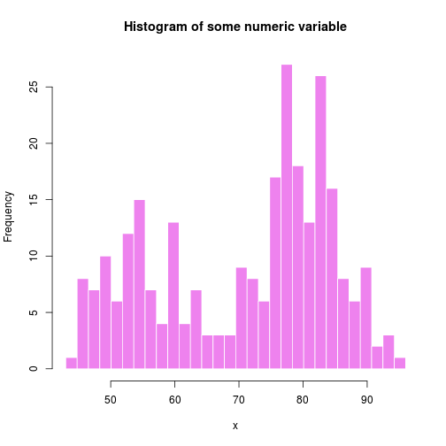

--- 
title       : Colorful histogram
subtitle    : Developing-Data-Products-Coursera
author      : sebnorth
job         : mathematician, programmer
framework   : io2012   # {io2012, html5slides, shower, dzslides, ...}
highlighter : highlight.js  # {highlight.js, prettify, highlight}
hitheme     : tomorrow      # 
widgets     : []            # {mathjax, quiz, bootstrap}
mode        : selfcontained # {standalone, draft}
knit        : slidify::knit2slides

---

## Experimenting with Shiny

Colorful histogram app is a simple extension of example from Shiny tutorial. 

We have some data, one variable(numeric - waiting time to next eruption (in mins) from 'Old Faithful Geyser Data' - 

http://stat.ethz.ch/R-manual/R-patched/library/datasets/html/faithful.html). 

--- 

## UI

User controls input using:

1. first slider to set number of bins of histogram 
2. second slider to set colour of bins 

After setting these two parameters you see the values of parameters in the table under histogram. 

--- 

## "reactive"-like widgets

Graph and table are "reactive" and therefore they automatically re-executed when inputs change. 

Defaults: 

* number of bins: 30
* color: violet 


```r
x <- faithful[, 2] 
bins <- seq(min(x), max(x), length.out = 30 + 1)
hist(x, breaks = bins, col = "violet", border = 'white', main = "Histogram of some numeric variable")
```

--- 

## histogram with deafults parameters

 
--- 


